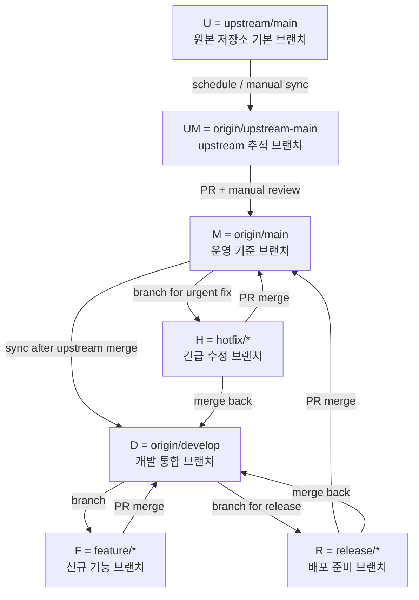

# Git Upstream Sync Workflow

이 문서는 `moonid-lab/MoneyBall` 저장소에서 포크한 원본 저장소의 `main` 브랜치 변경사항을 주기적으로 동기화하고, 이후 신규 기능 개발을 Gitflow 방식으로 운영하기 위한 전체 Git 전략을 정리합니다.

## 전체 운영 흐름도

아래 그림 하나로 이 저장소의 전체 Git 운영 흐름을 이해할 수 있습니다.



흐름도 약어:
- `U`: `upstream/main`
- `UM`: `origin/upstream-main`
- `M`: `origin/main`
- `D`: `origin/develop`
- `F`: `feature/*`
- `R`: `release/*`
- `H`: `hotfix/*`

요약:
- `upstream/main`은 `upstream-main`으로 추적합니다.
- upstream 반영은 `upstream-main -> main` PR로 검토 후 반영합니다.
- 기능 개발은 `develop`에서 분기한 `feature/*` 브랜치에서 진행합니다.
- 배포 준비는 `release/*`, 긴급 수정은 `hotfix/*` 브랜치로 운영합니다.

## 목적

이 저장소는 포크 기반으로 운영되며, 다음 두 가지 요구를 동시에 만족해야 합니다.

1. 원본 저장소(`upstream`)의 최신 변경사항을 지속적으로 추적한다.
2. 포크 저장소에서는 upstream 동기화와 신규 기능 개발을 서로 충돌 없이 운영한다.

이 문서의 전략은 `main` 브랜치를 직접 upstream 동기화 브랜치로 사용하지 않고, 별도의 추적 브랜치 `upstream-main`을 두는 한편, 신규 기능 개발은 Gitflow의 `develop` 중심 흐름으로 분리하는 방식입니다.

---

## 저장소 원격(remote) 구성

- `origin`: `git@github.com:moonid-lab/MoneyBall.git`
- `upstream`: `https://github.com/666ghj/MiroFish.git`

의미:
- `origin`은 내 포크 저장소입니다.
- `upstream`은 원본 저장소입니다.

---

## 브랜치 전략

### 브랜치 역할

- `upstream-main`
  - `upstream/main`을 추적하는 동기화 전용 브랜치
  - 원본 최신 상태를 반영하는 미러 브랜치
- `main`
  - 운영 기준 브랜치
  - upstream 반영과 release/hotfix 최종 merge 대상
- `develop`
  - 다음 개발 주기의 통합 브랜치
  - 모든 `feature/*` 브랜치의 기본 분기점
- `feature/*`
  - 신규 기능 개발 브랜치
  - `develop`에서 분기하고 `develop`으로 PR
- `release/*`
  - 배포 준비 브랜치
  - `develop`에서 분기하고 `main`으로 PR 후 다시 `develop`에 반영
- `hotfix/*`
  - 운영 중 긴급 수정 브랜치
  - `main`에서 분기하고 `main`으로 PR 후 다시 `develop`에 반영

### 왜 `main`을 동기화 브랜치로 쓰지 않는가

Gitflow에서 `main`은 운영 기준 브랜치이므로, 여기에 upstream 동기화 역할까지 동시에 부여하는 것은 비추천입니다.

문제점:
- upstream 추적 이력과 내 커스텀 개발 이력이 섞입니다.
- 충돌 관리가 어려워집니다.
- 원본 변경과 내 변경의 구분이 어려워집니다.
- 장기 유지보수와 검토가 복잡해집니다.

따라서 다음처럼 역할을 분리합니다.

- `upstream/main` → 원본 최신 상태
- `upstream-main` → 원본 추적용 브랜치
- `main` → 운영 기준 브랜치
- `develop` → 기능 통합 브랜치
- `feature/*`, `release/*`, `hotfix/*` → Gitflow 작업 브랜치

---

## 동기화 운영 원칙

이 저장소에서는 `main` 브랜치에 직접 자동 push 하지 않는 방식을 채택합니다.

즉:
- GitHub Actions가 `upstream/main`의 변경을 감지합니다.
- 로컬/원격의 `upstream-main` 브랜치를 최신으로 갱신합니다.
- `upstream-main`에서 `main`으로 향하는 Pull Request를 자동 생성합니다.
- 최종 반영은 사람이 검토 후 수동 merge 합니다.
- upstream 반영이 `main`에 merge 되면, 이후 `main`의 변경을 `develop`에도 반영합니다.

이 방식의 장점:
- `main` 브랜치 보호 정책과 잘 맞습니다.
- 자동 반영으로 인한 예기치 않은 문제를 줄일 수 있습니다.
- 충돌이 있어도 PR 단계에서 안전하게 검토할 수 있습니다.
- upstream 동기화 흐름과 Gitflow 개발 흐름을 분리할 수 있습니다.

---

## GitHub Actions 트리거 전략

### 사용 트리거

```yaml
on:
  workflow_dispatch:
  schedule:
    - cron: '0 2 * * *'
```

의미:
- `workflow_dispatch`: 필요 시 수동 실행 가능
- `schedule`: 매일 UTC 02:00 자동 실행

참고:
- GitHub Actions의 cron은 UTC 기준입니다.
- `0 2 * * *`는 한국 시간(KST) 기준 오전 11시입니다.

### 왜 upstream push 이벤트를 직접 받지 않는가

GitHub Actions는 기본적으로 **해당 저장소 내부 이벤트**를 기준으로 동작합니다.
따라서 외부 저장소인 `upstream`의 `push` 이벤트를 내 포크 저장소에서 직접 트리거로 받을 수 없습니다.

그래서 이 문서에서는 **주기적 polling 방식(`schedule`)**을 사용합니다.

---

## 최종 워크플로우 동작 방식

워크플로우 파일:
- `.github/workflows/sync-upstream-main.yml`

동작 순서:

1. `origin/main`과 `upstream/main`을 fetch 합니다.
2. `upstream/main`의 최신 SHA를 읽습니다.
3. `origin/upstream-main`의 현재 SHA를 읽습니다.
4. 두 SHA가 같으면 종료합니다.
5. 다르면 로컬 `upstream-main` 브랜치를 `upstream/main`과 동일하게 맞춥니다.
6. `origin/upstream-main`에 강제 동기화 push 합니다.
7. `upstream-main -> main` Pull Request가 이미 열려 있는지 확인합니다.
8. 기존 PR이 없으면 새 PR을 생성합니다.
9. 이후 검토자가 충돌 해결 또는 검토 후 수동으로 merge 합니다.

핵심 포인트:
- `main`에 직접 push 하지 않습니다.
- 항상 PR 기반으로 반영합니다.
- 중복 PR 생성은 방지합니다.

### upstream 반영 후 추가 운영 규칙

`upstream-main -> main` PR이 merge 되면, Gitflow 기준 다음 동작을 바로 이어서 수행하는 것을 권장합니다.

1. `main`의 최신 변경을 `develop`에 반영합니다.
2. 진행 중인 `feature/*` 또는 `release/*` 브랜치는 필요 시 `develop` 최신 상태를 다시 반영합니다.
3. 오래 열린 브랜치는 조기에 충돌을 해소합니다.

권장 예시:

```bash
git checkout develop
git pull origin develop
git merge origin/main
git push origin develop
```

이 규칙이 중요한 이유:
- 신규 기능 브랜치는 `develop`에서 분기되기 때문입니다.
- upstream 변경이 `main`에만 반영되고 `develop`에 전파되지 않으면 이후 기능 작업에서 충돌이 늦게 드러납니다.

---

## Gitflow 기반 신규 기능 개발 전략

### 1. 일반 기능 개발

일반적인 신규 기능은 항상 `develop`에서 `feature/*` 브랜치를 생성해 진행합니다.

예시:
- `feature/player-search`
- `feature/team-dashboard`
- `feature/improve-ranking-ui`

권장 흐름:

```bash
git checkout develop
git pull origin develop
git checkout -b feature/player-search

# 개발 진행
git add .
git commit -m "Add player search flow"
git push -u origin feature/player-search
```

이후:
- `feature/player-search -> develop` PR 생성
- 리뷰 및 테스트 후 `develop`에 merge

### 2. 배포 준비

기능 묶음을 배포 가능한 상태로 정리할 때는 `release/*` 브랜치를 사용합니다.

예시:
- `release/1.2.0`
- `release/2026-05`

권장 흐름:

1. `develop`에서 `release/*` 브랜치 생성
2. 버전 정리, 문구 수정, 배포 직전 안정화 작업 수행
3. `release/* -> main` PR 생성
4. merge 후 동일 변경을 `develop`에도 반영

### 3. 긴급 운영 수정

운영 중 장애나 긴급 수정은 `main`에서 `hotfix/*` 브랜치를 생성해 처리합니다.

예시:
- `hotfix/login-redirect`
- `hotfix/missing-env-check`

권장 흐름:

1. `main`에서 `hotfix/*` 브랜치 생성
2. 수정 후 `hotfix/* -> main` PR 생성
3. merge 후 동일 변경을 `develop`에도 반영

### 4. 브랜치 생성 기준 요약

- 신규 기능: `develop`에서 `feature/*`
- 배포 준비: `develop`에서 `release/*`
- 긴급 수정: `main`에서 `hotfix/*`
- upstream 추적: `upstream/main`에서 `upstream-main`

### 5. 운영 원칙

- `main`에서 직접 기능 개발하지 않습니다.
- `upstream-main`에서 직접 기능 개발하지 않습니다.
- 하나의 기능 브랜치에는 하나의 목적만 담습니다.
- merge 완료한 브랜치는 재사용하지 않고 삭제합니다.
- 장기 작업 브랜치는 주기적으로 `develop` 또는 `main` 최신 변경을 반영합니다.

---

## 최종 워크플로우 파일

아래는 현재 기준 최종 워크플로우입니다.

````yaml
name: Sync upstream main by pull request

on:
  workflow_dispatch:
  schedule:
    - cron: '0 2 * * *'

permissions:
  contents: write
  pull-requests: write

concurrency:
  group: sync-upstream-main-pr
  cancel-in-progress: false

jobs:
  sync:
    runs-on: ubuntu-latest

    steps:
      - name: Checkout repository
        uses: actions/checkout@v4
        with:
          fetch-depth: 0
          ref: main

      - name: Configure git identity
        run: |
          git config user.name "github-actions[bot]"
          git config user.email "41898282+github-actions[bot]@users.noreply.github.com"

      - name: Configure upstream remote
        run: |
          if git remote get-url upstream >/dev/null 2>&1; then
            git remote set-url upstream https://github.com/666ghj/MiroFish.git
          else
            git remote add upstream https://github.com/666ghj/MiroFish.git
          fi

      - name: Fetch branches
        run: |
          git fetch origin main
          git fetch upstream main

      - name: Resolve upstream SHA
        id: upstream_sha
        run: |
          echo "sha=$(git rev-parse upstream/main)" >> "$GITHUB_OUTPUT"

      - name: Resolve origin upstream-main SHA
        id: current_sync_sha
        run: |
          if git ls-remote --exit-code origin refs/heads/upstream-main >/dev/null 2>&1; then
            echo "sha=$(git ls-remote origin refs/heads/upstream-main | awk '{print $1}')" >> "$GITHUB_OUTPUT"
          else
            echo "sha=" >> "$GITHUB_OUTPUT"
          fi

      - name: Stop if no upstream changes
        if: steps.upstream_sha.outputs.sha == steps.current_sync_sha.outputs.sha
        run: echo "No upstream/main changes detected."

      - name: Update local upstream-main branch
        if: steps.upstream_sha.outputs.sha != steps.current_sync_sha.outputs.sha
        run: |
          if git show-ref --verify --quiet refs/heads/upstream-main; then
            git checkout upstream-main
          else
            git checkout -b upstream-main upstream/main
          fi
          git reset --hard upstream/main

      - name: Push upstream-main to origin
        if: steps.upstream_sha.outputs.sha != steps.current_sync_sha.outputs.sha
        run: |
          git push origin upstream-main --force-with-lease

      - name: Create or reuse pull request
        if: steps.upstream_sha.outputs.sha != steps.current_sync_sha.outputs.sha
        uses: actions/github-script@v7
        with:
          script: |
            const owner = context.repo.owner;
            const repo = context.repo.repo;
            const head = `${owner}:upstream-main`;
            const base = 'main';
            const upstreamSha = '${{ steps.upstream_sha.outputs.sha }}';

            const existing = await github.rest.pulls.list({
              owner,
              repo,
              state: 'open',
              head,
              base
            });

            if (existing.data.length > 0) {
              core.info(`PR already exists: ${existing.data[0].html_url}`);
              return;
            }

            const pr = await github.rest.pulls.create({
              owner,
              repo,
              title: `Sync upstream/main into main (${upstreamSha.slice(0, 7)})`,
              head: 'upstream-main',
              base: 'main',
              body: [
                'This pull request updates `upstream-main` from the upstream repository and proposes merging it into `main`.',
                '',
                `- Upstream repository: https://github.com/666ghj/MiroFish`,
                `- Upstream branch: \`main\``,
                `- Upstream commit: \`${upstreamSha}\``,
                '',
                'Review the changes and merge this PR manually.'
              ].join('\n')
            });

            core.info(`Created PR: ${pr.data.html_url}`);
````

---

## 브랜치 보호 전략

### 권장 사항

이 저장소에서는 `main`을 운영 기준 브랜치, `develop`을 개발 통합 브랜치로 사용하므로, 최소한 `main`에 대해서는 **브랜치 보호를 유지하는 것을 권장**합니다.

추천 설정 방향:
- `main` 직접 push 제한 유지
- Pull Request 기반 merge 유지
- 필요 시 status check 적용

### 이유

이 워크플로우는 `main`에 직접 push 하지 않기 때문에, 브랜치 보호 정책과 충돌하지 않습니다.
오히려 보호 설정이 활성화되어 있어야 실수로 직접 반영되는 위험을 줄일 수 있습니다.

---

## 브랜치 보호 설정 위치

### Branch protection rule 또는 Rulesets 확인 위치

1. 저장소로 이동
2. **Settings**
3. 다음 중 하나로 이동
   - **Branches**
   - 또는 **Rules → Rulesets**

확인할 항목 예시:
- Require a pull request before merging
- Require status checks to pass before merging
- Restrict who can push to matching branches
- Do not allow bypassing the above settings

현재 전략에서는 위 항목들을 해제할 필요가 없습니다.
오히려 `main`은 보호된 상태로 유지하는 것이 적합합니다.

---

## 저장소 설정 권장값

### Actions 권한 설정

경로:
- **Settings → Actions → General**

권장:
- **Workflow permissions**: `Read and write permissions`

이 권한이 있어야 workflow가 다음 작업을 수행할 수 있습니다.
- `upstream-main` 브랜치 push
- Pull Request 생성

---

## 운영 예시

### 시나리오 1: upstream 변경 없음

- workflow 실행
- `upstream/main`과 `origin/upstream-main` SHA 비교
- 동일하면 종료

### 시나리오 2: upstream 변경 있음

- `upstream-main` 갱신
- `origin/upstream-main` push
- 기존 PR 확인
- PR이 없으면 `upstream-main -> main` PR 생성

### 시나리오 3: 이미 PR이 열려 있음

- `upstream-main`은 최신으로 갱신됨
- 기존 open PR 재사용
- 새 PR은 생성하지 않음

---

## 수동 검토 및 반영 절차

1. 자동 생성된 PR을 확인합니다.
2. 변경 내용을 검토합니다.
3. 충돌이 있다면 PR 또는 로컬에서 해결합니다.
4. 테스트 후 `main`에 merge 합니다.
5. merge 후 `develop`에도 최신 `main` 변경을 반영합니다.

이 절차를 통해 upstream 변경을 안전하게 `main`에 반영하고, 이후 Gitflow 개발선인 `develop`까지 일관되게 유지할 수 있습니다.

---

## 요약

이 문서의 최종 전략은 다음과 같습니다.

- `upstream/main`은 `upstream-main` 브랜치로 추적합니다.
- upstream 반영은 `upstream-main -> main` PR로 수동 검토 후 반영합니다.
- `main`은 운영 기준 브랜치, `develop`은 개발 통합 브랜치로 사용합니다.
- 신규 기능은 `develop`에서 분기한 `feature/*` 브랜치에서 개발합니다.
- 배포 준비는 `release/*`, 긴급 수정은 `hotfix/*` 브랜치로 운영합니다.
- `main`에 upstream 변경이 반영되면 `develop`에도 즉시 동기화합니다.

이 전략은 포크 저장소의 upstream 추적과 Gitflow 기반 기능 개발을 분리하여, 장기적으로 안정적인 운영과 확장 가능한 개발 흐름을 동시에 확보하기 위한 방식입니다.
